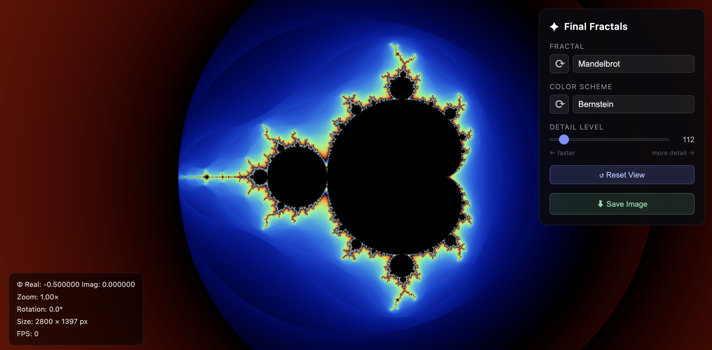

# ✦ Final Fractals

An interactive fractal explorer that runs in the browser — no install, no plugins, just WebGL2.

Pan, zoom, and rotate through five classic fractal sets in real time. The rendering is done entirely on the GPU via WebGL2 fragment shaders, so even high iteration counts stay smooth.

**[Live demo →](https://greg7gkb.github.io/final-fractals/)** *(after GitHub Pages deployment)*



---

## Fractals

| # | Name | Formula | Notes |
|---|------|---------|-------|
| 1 | **Mandelbrot** | z ← z² + c,  z₀ = 0 | The classic. c is the pixel. |
| 2 | **Julia Set** | z ← z² + c,  z₀ = pixel | c is a user-controlled constant — change it to explore wildly different shapes. |
| 3 | **Burning Ship** | z ← (\|Re(z)\| + \|Im(z)\|·i)² + c | Taking absolute values before squaring "folds" the plane. |
| 4 | **Newton** | z ← (2z³ + 1) / (3z²) | Colours by which root of z³ = 1 the iteration converges to. |
| 5 | **Tricorn** | z ← conj(z)² + c | Conjugating z before squaring breaks analytic symmetry, giving a 3-fold "cactus" shape. |

## Color Schemes

- **Ultra Smooth** — cycling HSV hue with subtle brightness pulses
- **Fire** — black → red → orange → yellow → white
- **Electric** — black → indigo → electric blue → cyan → white
- **Grayscale** — clean luminance ramp
- **Rainbow** — full HSV sweep (vivid / psychedelic)

---

## Controls

### Mouse / Trackpad
| Action | Effect |
|--------|--------|
| Drag | Pan |
| Scroll wheel | Zoom (centred on cursor) |
| Double-click | Zoom in ×2 to that point |
| Ctrl + Drag | Rotate |
| Pinch | Zoom (touch / precision trackpad) |

### Keyboard
| Key | Effect |
|-----|--------|
| `↑` `↓` `←` `→` | Pan |
| `+` / `−` | Zoom in / out |
| `,` / `.` | Rotate |
| `R` | Reset view |
| `1`–`5` | Switch fractal |
| `U` | Toggle UI panels |
| `H` | Toggle help overlay |

---

## Running locally

```bash
git clone https://github.com/greg7gkb/final-fractals.git
cd final-fractals
npm install
npm run dev
```

Then open `http://localhost:5173` in any modern browser (Chrome, Firefox, Edge, Safari 15+).

```bash
npm run build    # production build → dist/
npm run preview  # serve the production build locally
```

---

## Deploying to GitHub Pages

1. Edit `vite.config.ts` and set `base: '/final-fractals/'`
2. Run `npm run build`
3. Push the `dist/` folder to the `gh-pages` branch, or configure GitHub Actions to do it automatically.

A minimal workflow (`.github/workflows/deploy.yml`):

```yaml
name: Deploy to GitHub Pages
on:
  push:
    branches: [main]
jobs:
  deploy:
    runs-on: ubuntu-latest
    steps:
      - uses: actions/checkout@v4
      - uses: actions/setup-node@v4
        with: { node-version: 20 }
      - run: npm ci && npm run build
      - uses: peaceiris/actions-gh-pages@v4
        with:
          github_token: ${{ secrets.GITHUB_TOKEN }}
          publish_dir: ./dist
```

---

## How it works — WebGL2 architecture

This section explains the code-to-pixel pipeline for those who want to understand or extend the renderer.

### The big picture

```
JavaScript (CPU)                 GPU
────────────────                 ─────────────────────────────────────────
main.ts                          Vertex shader (×3 vertices)
  │  sets uniforms               │  emits: one giant triangle covering the screen
  │  calls drawArrays()    ───►  │
  │                              ▼
  │                              Rasteriser
  │                              │  for every pixel inside the triangle:
  │                              ▼
  │                              Fragment shader (×width×height pixels, in parallel)
  │                              │  1. pixel → complex number   (coordinate transform)
  │                              │  2. iterate fractal formula  (escape-time loop)
  │                              │  3. escape count → colour    (palette function)
  │                              ▼
  │                              Framebuffer  →  screen
```

### Key files

| File | Purpose |
|------|---------|
| `src/renderer/shaders.ts` | All GLSL source code, extensively commented. Start here to understand the math. |
| `src/renderer/WebGLRenderer.ts` | Compiles shaders, links the GPU program, uploads uniforms, issues the draw call. |
| `src/navigation/Camera.ts` | View state: centre, zoom, rotation. Also the pixel→complex coordinate transform that mirrors the shader logic. |
| `src/navigation/InputHandler.ts` | Translates mouse/touch/keyboard events into camera mutations. |
| `src/ui/Controls.ts` | Wires HTML controls ↔ shader uniforms. |
| `src/main.ts` | Entry point; `requestAnimationFrame` render loop with dirty-flag optimisation. |

### Coordinate transform

Every pixel needs to know which complex number to test. The transform (in both the shader and `Camera.ts`) is:

```
pixel (x, y)
  → normalise to [-0.5·aspect, 0.5·aspect] × [-0.5, 0.5]  (origin = screen centre)
  → scale by zoom  (zoom = visible height in complex units)
  → rotate by camera.rotation
  → translate by camera.center
  = c  (the complex number to iterate)
```

### Escape-time colouring

For Mandelbrot/Julia/BurningShip/Tricorn, we iterate until `|z|² > 4` (the escape condition), then compute a smooth colour value:

```
smooth_t = (i − log₂(log₂(|z|²) / 2)) / maxIterations
```

The nested log removes the discrete "banding" you'd get from raw integer counts, giving smooth colour gradients.

### Newton fractal

Newton's method for `f(z) = z³ − 1` converges to one of three roots. We colour by *which root* (red / green / blue) and modulate brightness by *convergence speed*. This produces the characteristic tricolour fractal boundary regions.

---

## Browser requirements

WebGL2 is supported by all modern browsers (Chrome 56+, Firefox 51+, Safari 15+, Edge 79+). If your browser doesn't support it, you'll see an error message on the canvas.

---

## License

MIT — do whatever you like with it.
