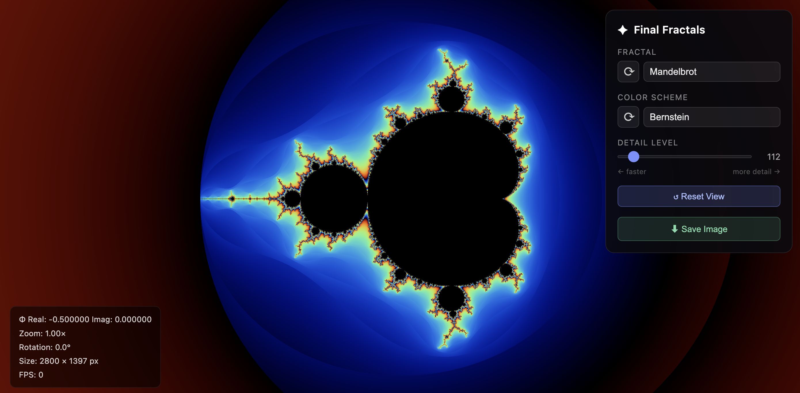

# ✦ Final Fractals

An interactive fractal explorer that runs in the browser — no install, no plugins, just WebGL2.

Pan, zoom, and rotate through thirteen fractal sets in real time. Rendering is done entirely on the GPU via WebGL2 fragment shaders. The five classical escape-time sets (Mandelbrot, Julia, Burning Ship, Tricorn, Celtic) use double-double arithmetic; the other eight use single-precision float32. In practice both modes are limited less by raw representation than by escape-time iteration amplifying error every step — see [Double-double precision](#double-double-precision) for the actual zoom ceilings.

**[Live demo →](https://greg7gkb.github.io/final-fractals/)**



---

## Fractals

The **Precision** column shows which arithmetic the iteration loop uses on the GPU: **dd** (double-double, ~15-digit representation) or **f32** (single-precision, ~7-digit representation). Iteration amplifies error roughly 2× per step near the set boundary, so the *visible* zoom ceiling is well short of either representation limit (see below).

| # | Name | Formula | Precision | Notes |
|---|------|---------|-----------|-------|
| 0 | **Mandelbrot** | z ← z² + c,  z₀ = 0 | dd | The classic. c is the pixel. |
| 1 | **Julia Set** | z ← z² + c,  z₀ = pixel | dd | c is a user constant — pick from presets or type your own. |
| 2 | **Burning Ship** | z ← (\|Re(z)\| + \|Im(z)\|·i)² + c | dd | Absolute values before squaring "fold" the plane into a ship silhouette. |
| 3 | **Newton** | z ← (2z³ + 1) / (3z²) | f32 | Colours by which root of z³ = 1 the iteration converges to. |
| 4 | **Tricorn** | z ← conj(z)² + c | dd | Conjugating before squaring breaks analytic symmetry, giving a 3-fold cactus shape. |
| 5 | **Custom** | z ← zⁿ + c,  n = 3 | f32 | De Moivre Multibrot — edit the shader to change the exponent. |
| 6 | **Magnet I** | z ← ((z²+c−1)/(2z+c−2))² | f32 | Rational map from renormalisation theory; bulbous Mandelbrot-like chains. |
| 7 | **Magnet II** | cubic rational analogue of Magnet I | f32 | Three root branches produce richer nested-spiral decorations. |
| 8 | **Phoenix** | z ← z²+c + p·z_prev,  p=−0.5 | f32 | Memory term stretches the set into feather/wing shapes. |
| 9 | **Celtic** | z ← \|Re(z²)\| + i·Im(z²) + c | dd | Mandelbrot with real axis folded — sea-horse tails curl outward. |
| 10 | **sin(z) + c** | z ← sin(z) + c | f32 | Periodic bubble-galaxy patterns repeating every 2π on the real axis. |
| 11 | **eᶻ + c** | z ← eᶻ + c | f32 | "Explosion" fractal — infinite parallel fingers from a crescent boundary. |
| 12 | **Rational (λ/z²)** | z ← z²+c+0.25/z² | f32 | McMullen-domain ring structure around the origin. |

The Julia Set panel includes a preset picker (Douady's Rabbit, San Marco Dragon, Dendrite, and more) as well as free Re/Im inputs.

---

## Running locally

```bash
git clone https://github.com/greg7gkb/final-fractals.git
cd final-fractals
npm install
npm run dev
```

Then open `http://localhost:5173` in any modern browser (Chrome, Firefox, Edge, Safari 15+).

```bash
npm run build    # production build → dist/
npm run preview  # serve the production build locally
```

---

## How it works — WebGL2 architecture

This section explains the code-to-pixel pipeline for those who want to understand or extend the renderer.

### The big picture

```
JavaScript (CPU)                 GPU
────────────────                 ─────────────────────────────────────────
main.ts (frame loop)             Vertex shader (×3 vertices)
  │  sets uniforms               │  emits: one giant triangle covering the screen
  │  calls drawArrays()    ───►  │
  │                              ▼
  │                              Rasteriser
  │                              │  for every pixel inside the triangle:
  │                              ▼
  │                              Fragment shader (×width×height pixels, in parallel)
  │                              │  1. pixel → complex number   (coordinate transform)
  │                              │  2. iterate fractal formula  (escape-time loop)
  │                              │  3. escape count → colour    (palette function)
  │                              ▼
  │                              Framebuffer  →  screen
```

The CPU entry point is [`frame()` in `src/main.ts`](src/main.ts), which uses a dirty flag so the GPU is only invoked when the view actually changes.

### Key files

| File | Purpose |
|------|---------|
| [`src/renderer/shaders.ts`](src/renderer/shaders.ts) | All GLSL source — dd arithmetic, all 13 fractal functions, 11 colour palettes. Start here for the math. |
| [`src/renderer/WebGLRenderer.ts`](src/renderer/WebGLRenderer.ts) | Compiles shaders, links the GPU program, uploads uniforms, issues the draw call. |
| [`src/navigation/Camera.ts`](src/navigation/Camera.ts) | View state: centre, zoom, rotation. Pixel↔complex transforms that mirror the shader logic. |
| [`src/navigation/InputHandler.ts`](src/navigation/InputHandler.ts) | Translates mouse/touch/keyboard events into camera mutations. |
| [`src/navigation/PanMomentum.ts`](src/navigation/PanMomentum.ts) | Inertial pan coasting after mouse release — O(1) ring buffer velocity sampling, exponential decay RAF loop. |
| [`src/ui/Controls.ts`](src/ui/Controls.ts) | Wires HTML controls ↔ shader uniforms, including cycle buttons and the Julia preset picker. |
| [`src/ui/GridOverlay.ts`](src/ui/GridOverlay.ts) | 2D canvas overlay that draws labelled complex-plane gridlines. |
| [`src/main.ts`](src/main.ts) | Entry point; `requestAnimationFrame` loop with dirty-flag optimisation and FPS tracking. |

### Coordinate transform

Every pixel needs to know which complex number to test. The transform is implemented twice — once in `pixelToComplexDD()` in `shaders.ts` (GLSL, GPU) and once in `pixelToComplex()` in `Camera.ts` (TypeScript, mouse hit-testing) — and they must stay in sync:

```
pixel (x, y)
  → normalise to [-0.5·aspect, 0.5·aspect] × [-0.5, 0.5]  (origin = screen centre)
  → scale by zoom  (zoom = visible height in complex units)
  → rotate by camera.rotation
  → translate by camera.center
  = c  (the complex number to iterate)
```

### Double-double precision

GPU shaders use 32-bit floats (~7 significant digits). At deep zoom, adjacent pixels become indistinguishable and the image degrades into blocky rectangles. To extend the representable depth, Mandelbrot, Julia, Burning Ship, Tricorn, and Celtic use *double-double* arithmetic: every value is a pair of float32s `(hi, lo)` where `hi + lo` holds ~15 significant digits — about the same as a float64. The extra precision costs roughly 4–8× more GPU work per pixel.

**The catch: iteration amplifies error.** The escape-time map `z ← z² + c` is dynamical, so a tiny perturbation in `c` gets multiplied by ~|2z| every step. Near the set boundary `|z|` hovers around 1–2, so error roughly doubles each iteration. After ~50 boundary-region iterations dd's 15-digit budget is exhausted, regardless of the static representation depth. The practical clean-zoom ceilings are therefore much lower than the per-number precision suggests:

| Mode | Static representation | Clean zoom (near boundary) |
|---|---|---|
| **f32** | ~7 digits, ~10⁷ static depth | **~10⁴–10⁵×** before pixelation |
| **dd**  | ~15 digits, ~10¹⁴ static depth | **~10⁵–10⁶×** before iteration noise; somewhat deeper in calmer regions |

Cranking the iteration slider doesn't help once the noise starts — adjacent pixels still escape at well-defined counts, the counts just diverge wildly because the iteration has amplified their tiny `c` difference. The image goes from "fractal" to rainbow confetti.

To actually exercise dd's ~10¹⁴ depth you'd need **perturbation theory**: compute one reference orbit at high precision once, then iterate low-precision *deltas* around it. The deltas stay small, so error compounds slowly. That's how dedicated deep-zoom tools (Kalles Fractaler, Fractal eXtreme) reach 10¹⁰⁰⁰⁺ zoom. Not currently implemented here.

### Escape-time colouring

For escape-time fractals we iterate until `|z|² > R²` then smooth the count via:

```
smooth_t = (i − log₂(log₂(|z|²) / 2)) / maxIterations
```

The nested log removes discrete banding, giving smooth colour gradients across all 11 palettes (Bernstein, Ultra Smooth, Fire, Electric, Grayscale, Rainbow, Shark Blue, Silver, Carmine, Twilight, Lava).

### Newton fractal

Newton's method for `f(z) = z³ − 1` converges to one of three roots. Pixels are coloured by *which root* (red / green / blue) modulated by *convergence speed*, producing the characteristic tricolour boundary regions.

### Pan momentum

Mouse pan releases trigger an inertial coast via `PanMomentum`. A 32-slot O(1) ring buffer records complex-plane velocity samples during the drag. On release, the last 80 ms of samples are summed to estimate velocity, which then decays exponentially in a separate `requestAnimationFrame` loop (frame-rate-independent: `decay = friction^(dt/16.667ms)`).

---

## Browser requirements

WebGL2 is supported by all modern browsers (Chrome 56+, Firefox 51+, Safari 15+, Edge 79+). If your browser doesn't support it, you'll see an error message on the canvas.

---

## License

MIT — do whatever you like with it.
